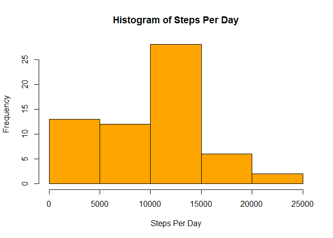
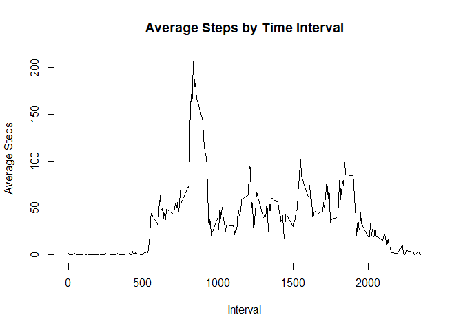
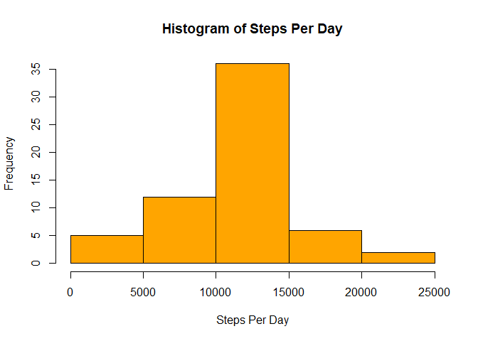
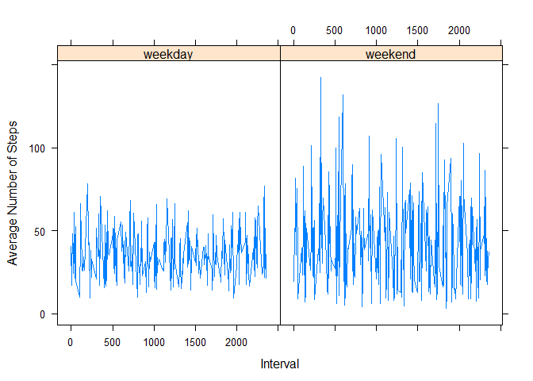

## Loading and preprocessing the data


```r
library(dplyr)
```

```
## 
## Attaching package: 'dplyr'
```

```
## The following objects are masked from 'package:stats':
## 
##     filter, lag
```

```
## The following objects are masked from 'package:base':
## 
##     intersect, setdiff, setequal, union
```

```r
# Read in the raw activity data
rawdata <- read.csv(unzip("activity.zip"))

# Step 1 - Calculate the total # of steps taken per day
sum(rawdata$steps,na.rm=TRUE)/length(unique(rawdata$date,na.rm=TRUE))
```

```
## [1] 9354.23
```

```r
# Step 2 - Histogram of total steps per day
stepsPerDay <- with(rawdata,tapply(steps,date,FUN="sum",na.rm=TRUE))
hist(stepsPerDay,col="orange",main="Histogram of Steps Per Day",xlab="Steps Per Day")
```

<!-- -->

## What is mean total number of steps taken per day?


```r
# Step 3 - Mean and Median of steps per day
mean(stepsPerDay)
```

```
## [1] 9354.23
```

```r
median(stepsPerDay)
```

```
## [1] 10395
```

## What is the average daily activity pattern?


```r
# Step 4 - Line plot of average steps in each interval across all days
stepsPerInterval <- aggregate(rawdata[,c("steps")],by=list(rawdata$interval),FUN=mean,na.rm=TRUE)
names(stepsPerInterval) <- c("interval","steps")
plot(stepsPerInterval$interval,stepsPerInterval$steps,type="l",
     main="Average Steps by Time Interval",
     ylab="Average Steps",
     xlab="Interval")
```

<!-- -->

```r
# Step 5 - which interval has the maximum average steps?
stepsPerInterval$interval[which.max(stepsPerInterval$steps)]
```

```
## [1] 835
```

## Imputing missing values

Use the mean for each interval across all days to impute missing values. The mean and median values differ from the raw data because there are new numbers in the calculation that were not there before (the imputed values).  Total steps per day has increased to very close to the median value for each day.

```r
# Step 6 - Number of records in the raw data with NA in steps
sum(is.na(rawdata$steps))
```

```
## [1] 2304
```

```r
# Step 7+8 - Fill in NAs with the interval average
cleandata <- merge(rawdata,stepsPerInterval,by="interval",all.x=TRUE)
cleandata <- mutate(cleandata,steps=ifelse(is.na(steps.x),steps.y,steps.x))
cleandata <- cleandata[,c("interval","date","steps")]

# Total steps per day
sum(cleandata$steps)/length(unique(cleandata$date))
```

```
## [1] 10766.19
```

```r
# Step 9 - Histogram of total steps per day
#        - Mean and Median of total steps per day
stepsPerDayClean <- with(cleandata,tapply(steps,date,FUN="sum",na.rm=TRUE))
hist(stepsPerDayClean,col="orange",main="Histogram of Steps Per Day",xlab="Steps Per Day")
```

<!-- -->

```r
mean(stepsPerDayClean)
```

```
## [1] 10766.19
```

```r
median(stepsPerDayClean)
```

```
## [1] 10766.19
```

## Are there differences in activity patterns between weekdays and weekends?

As expected there is more activity on weekends than weekdays.


```r
# Step 10+11 - Lattice plot of weekdays vs weekends
cleandata <- mutate(cleandata,day=weekdays(as.Date(date)))
cleandata <- mutate(cleandata,day=factor(day,c("Monday","Tuesday","Wednesday","Thursday",
                                               "Friday","Saturday","Sunday"),
                                         c("weekday","weekday","weekday","weekday",
                                           "weekday","weekend","weekend")))
library(lattice)
stepsPerInterval <- aggregate(cleandata[,c("steps")],by=list(rawdata$interval,cleandata$day),FUN=mean,na.rm=TRUE)
names(stepsPerInterval) <- c("interval","day","steps")
xyplot(steps ~ interval | day, data=stepsPerInterval, type="l",xlab="Interval",ylab="Average Number of Steps")
```

<!-- -->
